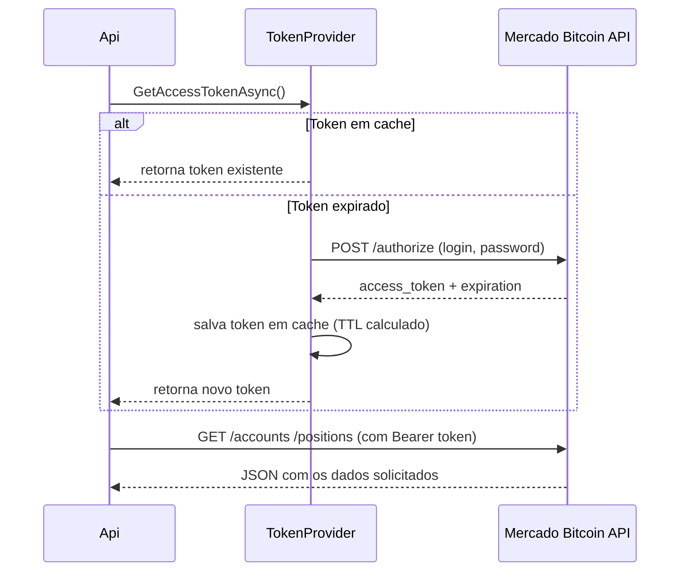

# Mercado Bitcoin Integration (.NET 8)

## Objetivo

Este projeto tem como objetivo integrar aplicações internas com a API oficial do Mercado Bitcoin, realizando:
- autenticação via endpoint `/authorize`;
- consulta de contas (`/accounts`);
- consulta de posições abertas (`/accounts/{accountId}/positions`).

A implementação foi feita em .NET 8 com uma arquitetura limpa e simplificada, garantindo baixo acoplamento, testabilidade e robustez.

---

## Estrutura de Pastas e Arquitetura

```
MB.Integration/
├── Api/         → Camada de apresentação (Controllers, Middleware, Program.cs)
├── Data/        → Contratos, DTOs e interfaces de serviço
├── Domain/      → (atualmente vazia) espaço para regras de negócio puras
├── Infra/       → Implementações concretas (Flurl, Cache, Providers, IoC)
└── Tests/       → Testes automatizados (xUnit, Moq, WireMock.Net, FluentAssertions)
```

| Camada | Responsabilidade |
|--------|------------------|
| Api | Contém os *Controllers* que expõem os endpoints internos e o `ExceptionMiddleware` global. |
| Data | Define interfaces, DTOs e contratos de integração (`IMercadoBitcoinApiService`, `IMercadoBitcoinAuthService`, `ITokenProvider`). |
| Domain | (Vazia no momento) — reservada para entidades e regras de negócio independentes de infraestrutura. |
| Infra | Implementa a lógica de integração com a API do Mercado Bitcoin via Flurl, controle de token com cache e registro de dependências. |
| Tests | Testes unitários e de integração usando mocks e servidor HTTP simulado (`WireMock.Net`). |

---

## Tecnologias e Ferramentas

| Categoria | Ferramenta | Descrição |
|------------|-------------|-----------|
| Linguagem / Runtime | .NET 8 / C# 12 | Base do projeto |
| HTTP Client | Flurl.Http | Cliente fluente para chamadas REST |
| Cache | IMemoryCache | Armazenamento em memória do token de autenticação |
| Injeção de Configuração | IOptions<T> | Gerencia configurações via `MbOptions` |
| Concorrência | SemaphoreSlim | Evita chamadas paralelas simultâneas na geração de token |
| Log | ILogger | Registra erros e exceções |
| Testes Unitários | xUnit | Framework de testes |
| Mocking | Moq | Mock de dependências |
| Mock HTTP | WireMock.Net | Simula a API do Mercado Bitcoin |
| Asserts Fluent | FluentAssertions | Expressões legíveis de validação |

---

## Fluxo de Autenticação



---

## Middleware Global de Exceções

Arquivo: `Api/Middlewares/ExceptionMiddleware.cs`

Responsável por capturar exceções não tratadas e retornar respostas padronizadas no formato JSON.

Exemplo de resposta:
```json
{
  "statusCode": 500,
  "message": "An unexpected error occurred."
}
```

### Tipos de exceções tratadas

| Tipo | Código | Descrição |
|------|---------|-----------|
| ArgumentException / ArgumentNullException | 400 | Parâmetros inválidos |
| UnauthorizedAccessException | 401 | Acesso não autorizado |
| TimeoutException | 408 | Tempo limite excedido |
| Exception | 500 | Erro interno genérico |

---

## Configuração (appsettings.json)

```json
{
  "MbOptions": {
    "BaseUrl": "https://api.mercadobitcoin.net/api/v4",
    "Auth": {
      "Login": "YOUR_LOGIN",
      "Password": "YOUR_PASSWORD",
      "RenewSkewSeconds": 60
    }
  }
}
```

---

## Endpoints Disponíveis

### GET /mercadobitcoin/accounts
Retorna as contas vinculadas à autenticação atual.

Exemplo de resposta:
```json
[
  {
    "currency": "BRL",
    "currencySign": "R$",
    "id": "a322205ace882ef800553118e5000066",
    "name": "Mercado Bitcoin",
    "type": "live"
  }
]
```

---

### GET /mercadobitcoin/accounts/{accountId}/positions?symbols=BTC-BRL
Retorna as posições abertas (ordens ativas) de uma conta específica.

Exemplo de resposta:
```json
[
  {
    "avgPrice": 380,
    "category": "limit",
    "id": "27",
    "instrument": "BTC-BRL",
    "qty": "0.001",
    "side": "buy"
  }
]
```

---

## Testes Automatizados

### Ferramentas utilizadas
- xUnit – estrutura de testes  
- Moq – mocks de dependências  
- WireMock.Net – mock HTTP realista  
- FluentAssertions – validações legíveis  

### Testes implementados
| Classe | Testes principais |
|---------|-------------------|
| MercadoBitcoinAuthService | Retorna token esperado via WireMock (mock do `/authorize`). |
| TokenProvider | Valida cache, TTL mínimo, concorrência (`SemaphoreSlim`). |
| MercadoBitcoinApiService | Valida chamadas HTTP reais com Bearer Token e query params. |

---

## Estrutura Simplificada de Código

```
Api/
 ├── Controllers/
 │    └── MercadoBitcoinController.cs
 ├── Middlewares/
 │    └── ExceptionMiddleware.cs
 └── Program.cs

Data/
 ├── Models/
 │    ├── AuthResponse.cs
 │    ├── AccountResponse.cs
 │    └── PositionResponse.cs
 └── Services/
      ├── IMercadoBitcoinApiService.cs
      ├── IMercadoBitcoinAuthService.cs
      └── ITokenProvider.cs

Infra/
 ├── External/MercadoBitcoin/
 │    ├── MercadoBitcoinApiService.cs
 │    ├── MercadoBitcoinAuthService.cs
 │    └── TokenProvider.cs
 └── DependencyInjection/
      └── ServiceCollectionExtensions.cs

Domain/
 └── (vazio por enquanto)

Tests/
 ├── MercadoBitcoinAuthServiceTests.cs
 ├── MercadoBitcoinApiServiceTests.cs
 └── TokenProviderTests.cs
```

---

## Como Executar

```bash
# Restaurar dependências
dotnet restore

# Executar API (Swagger disponível em /swagger)
dotnet run --project MB.Integration.Api

# Executar testes
dotnet test --logger "console;verbosity=detailed"
```

---

## Futuras Evoluções

- Adicionar camada **Domain** com regras de negócio (Position, ValueObjects etc.)
- Implementar **retry automático** no `MercadoBitcoinApiService` em caso de `401 Unauthorized`
- Adicionar **cache distribuído (Redis)** para ambientes em cluster
- Implementar **metrics/log tracing** com OpenTelemetry

---

## Licença
MIT — livre para uso, estudo e extensão.
